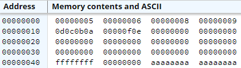
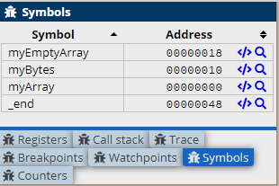

.. include:: ../global.rst

Array Basics
================================

.. index:: arrays

An array is simply a block of memory that is being used to store 1 or more same sized elements. In ARM assembly, we can create an array 
by assigning a label to a list of allocations or to a block of memory reserved with the ``.space`` directive:

.. armcode::  

   .data
   @array of 4 words (32-bit integers)
   myArray:      .word   5, 6, 8, 9

   @array of 6 bytes (8 bit integers)
   myBytes:      .byte   10, 11, 12, 13, 14, 15

   .align   @make sure we are padded to a full word
   @always do this after allocating bytes to make sure any words that come later are word aligned

   @40 bytes or 10 words (integers) worth of empty space
   myEmptyArray: .space  40

   @Easy to spot pattern at end of storage
   .word   0xFFFFFFFF

There are no instructions in that sample, but it does lay out the arrays in memory. To see, this, switch to the memory view. In it, you should be 
able to find the words of memory 5, 6, 8, and 9. They are followed by bytes of memory for 10-15 (0a-0f), then some padding to fill out the word that 0f is in, 
then 40 bytes of space, then 0xFFFFFFFF.

To help find the pieces of memory, you can use the Symbols tab. If you switch to it, all the labels you have declared will be shown 
along with their address:

   Use the magnifying glass to highlight the location in memory. Note that the highlight shows the word at that address, it does not 
   do anything to show you the size of the array that starts there.

