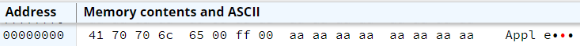

.. include:: ../global.rst

Strings
================================

.. index:: strings, asciz

Strings in assembly are simple an array of signed bytes (chars) interpreted by their ASCII code. 'A' is stored as 0x41, 'B' as 0x42, etc... 
By convention, they usually end with a NULL character - the value 0. This convention allows us to allocate large buffers (chunks of memory), 
only use the parts we need, and then later identify how much of the buffer is actually in use.

For example, given this chunk of memory:

.. raw:: html

   <table class="bit-table"><tbody>
   <tr class="bitsrow">
   <td class=" left-border highlight" colspan='4'>0x41</td>
   <td class=" left-border highlight" colspan='4'>0x70</td>
   <td class=" left-border highlight" colspan='4'>0x70</td>
   <td class=" left-border highlight" colspan='4'>0x6c</td>
   <td class=" left-border highlight" colspan='4'>0x65</td>
   <td class=" left-border highlight" colspan='4'>0x00</td>
   <td class=" left-border" colspan='4'>0x4f</td>
   <td class=" left-border" colspan='4'>0x92</td>
   <td class=" left-border" colspan='4'>0xa0</td>
   <td class=" left-border" colspan='4'>0x07</td>
   <td class=" left-border" colspan='4'>0x1c</td>
   <td class=" left-border" colspan='4'>0x1c</td>
   <td class=" left-border" colspan='4'>0x3d</td>
   <td class=" left-border" colspan='4'>0x82</td>
   <td class=" left-border" colspan='4'>0xbc</td>
   <td class=" left-border right-border" colspan='4'>0x0f</td>
   </tr>
   </table> 

We would interpret it to mean ``0x41 0x70 0x70 0x6c 0x65`` - the ``0x00`` says *"stop reading here"*. Anthing else in that buffer would be ignored.

The standard way to load a string is via the ``.asciz`` directive. (The z stands for the 0 at the end). 
It loads a given string into memory and adds a null byte 0x00 to end it. The sample below loads the chars 'A' 'p' 'p' 'l' 'e' and places a 0x00 after them:

.. armcode::  

   .data
   .asciz   "Apple"

   @use 0xFF to show where string ends
   .byte 0xFF

Displayed in byte mode (so that endianness doesn't change the order we see the chars in), the result looks like this:

.. note::

   There also is an .ascii which does not add a null byte to the end. 

----------------------------------------------------------------------------

To loop over a string, we use a loop that looks for a null char. The code sample below counts the 'e's in a string. It is roughly equivalent to the C++:

.. code-block:: c++

   int eCount = 0;
   int i = 0;
   while(myString[i] != '\0') {
      char current = myString[i];
      if (current == 'e')
         eCount += 1;
      i++;
   }

In the assembly version ``r`` holds the eCount, ``r2`` the base address of the string, and ``r3`` the index. Since each char is a single byte, we can use 
base address + index to calculate the memory address of each char:

.. armcode::  
   :linenos:
   :emphasize-lines: 10,11,25, 28, 29

   .data
   myString:   .asciz  "hello there people"
   .align      @force alignment to word boundary

   .text
   _start:
   MOV   r1, #0         @ r1 = eCount

   LDR   r2, =myString  @ r2 = base address of myString
   MOV   r3, #0         @ i = 0   - r3 will be index

   B     looptest       @ Jump to loop test

   loopstart:
      @We know that r4 has current char from doing test
      CMP   r4, #'e'       @ compare current char to e (0x65)
      BNE   endIf
      ADD   r1, #1         @ if equal, add one to counter
      
      endIf:
      ADD   r3, r3, #1     @ i++

   looptest:
   LDRB  r4, [r2, r3]   @ r4 = current char (myString[i])
                        @ Load as a BYTE!!!

   CMP   r4, #0         @ 0 char signifies end of string
   BNE   loopstart      @ If not null char, go through a loop iteration

   end:
   B     end                  @stop here