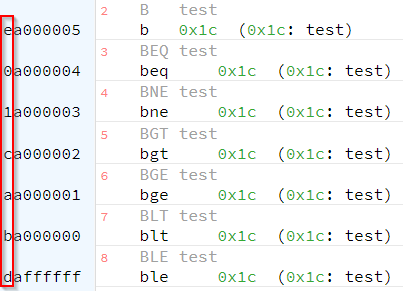

.. include:: ../global.rst

ARM Trick - Conditional Execution
=========================================

.. index:: conditional execution

In ARM machine code, the first four bits of most instructions are reserved for a condition code:

.. raw:: html

   <table class="bit-table"><tbody><tr><th>31</th><th>30</th><th>29</th><th>28</th><th>27</th><th>26</th><th>25</th><th>24</th><th>23</th><th>22</th><th>21</th><th>20</th><th>19</th><th>18</th><th>17</th><th>16</th><th>15</th><th>14</th><th>13</th><th>12</th><th>11</th><th>10</th><th>9</th><th>8</th><th>7</th><th>6</th><th>5</th><th>4</th><th>3</th><th>2</th><th>1</th><th>0</th></tr>
   <tr class="bitsrow">
   <td class=" left-border highlight" colspan='4'>condition</td>
   <td class=" left-border right-border" colspan='28'>opcode and other information</td>
   </tr>
   </table>

In this assembled example code, there are a series of branches with different conditions. Notice that the first hex digit of the instruction 
is different for each one. The second hex digit is always 'a', which corresponds to 'branch'. (The last 24 bits, the addresses, are different as well, as each instruction is one instruction closer to the 
branch target *test*.)

These same four conditional bits also exist in most basic (movement, bitwise, arithmetic) instructions. Which means that instead of using 
a compare and branch to skip instructions, we can do a comparison and use the result of it to specify whether or not to actually do the work
in following instructions. 

In the sample below, lines 13 and 14 are both always executed. But, if the condition code is

Line 13 only executes if the comparison on line 11 indicated equality. Line 14 only executes if it did not.

.. armcode::  
   :linenos:
   :emphasize-lines: 11,13,14

      .data
      x:      .word   2
      y:      .word   0

      .text
      _start:
      LDR     r1, =x      @load x's address
      LDR     r1, [r1]    @r1 = x

      CMP     r1, #2      @test r1 vs 2 (calculate r1 - 2)

      MOVEQ   r2, #5      @only executed if CMP set status indicating values EQual
      MOVNE   r2, #3      @only executed if CMP set status indicating values Not Equal

      LDR     r3, =y      @load y's address
      STR     r2, [r3]    @store result back to y

Why does this trick exist? Those 4 bits are valuable real estate in the machine instruction format. The answer is efficiency.

Using conditional execution in the sample above resulted in 3 lines of code to implement the if/else. 
An implementation using branches would result in 5 lines. Furthermore, executing branches 
can be a major source of slow downs in modern pipelined processors. So even in a larger if/else structure - one where the if and else each 
contained 5 instructions - we might very well be better off always executing all 10 instructions and just ignoring 5 of them than 
using branches to only execute the correct five instructions.

.. note::

      Fun fact: the condition code for "always" is 1110 or hex E. That is why most normal instructions in ARM assembly 
      start with E.