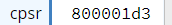

.. include:: ../global.rst

Condition Codes
================================

.. index:: conditions, CPSR

The ARM processor maintains a special register known as the **Current Program Status Register** or ``CPSR``.

The ``CPSR`` is used to track information about what mode the processor is in and the result of recent instructions. 
In particular, the upper 4 bits of the register are used to track the following information:

.. raw:: html

   <table class="bit-table"><tbody><tr><th>31</th><th>30</th><th>29</th><th>28</th><th>27</th><th>26</th><th>25</th><th>24</th><th>23</th><th>22</th><th>21</th><th>20</th><th>19</th><th>18</th><th>17</th><th>16</th><th>15</th><th>14</th><th>13</th><th>12</th><th>11</th><th>10</th><th>9</th><th>8</th><th>7</th><th>6</th><th>5</th><th>4</th><th>3</th><th>2</th><th>1</th><th>0</th></tr>
   <tr class="bitsrow">
   <td class=" left-border highlight" colspan='1'>N</td>
   <td class=" left-border highlight" colspan='1'>Z</td>
   <td class=" left-border highlight" colspan='1'>C</td>
   <td class=" left-border highlight" colspan='1'>V</td>
   <td class=" left-border" colspan='21'></td>
   <td class=" left-border right-border" colspan='7'>operating mode</td>
   </tr>
   </table>

* **N** Was the result **n**\ egative?

* **Z** Was the result **z**\ ero?

* **C** Was there a **c**\ arry out of the leftmost bit? (Though this bit is used in complex ways that do not always mean carry.)

* **V** Was there mathematical o\ **v**\ erflow? (For signed math this is not the same as having a carry out of the leftmost bit.)

.. tip:: 

      The exact rules for setting the carry bit are complex and depend on the type of comparison instruction being executed. 
      You are not responsible for the details, just recognize that the carry bit does not always mean a literal carry.

..index:: CMP

These values are only set by specific instructions. The most straightforward of these instructions is **compare**:

.. armlisting::  CMP rn, rm / #

   CoMPare. Subtract rm or # by from rn and update the status registers based on the results. The result of the 
   subtraction is ignored.

In this code sample below the value 10 is compared with something larger, something smaller, and itself. The only result of 
running the ``CMP`` instructions is to change the ``CPSR``.

.. armcode::  
   :linenos:

   MOV     r1, #10         @load x's address

   CMP     r1, #20         @do r1 - 20, set result bits
   @result bits are now 0x8 or 0b1000 : only Negative is set

   CMP     r1, #2          @do r1 - 2, set result bits
   @result bits are now 0x2 or 0b0010 : only carry bit was set
   
   CMP     r1, #10         @do r1 - 10, set result bits
   @result bits are now 0x6 or 0b0110 : carry and zero bits are set
