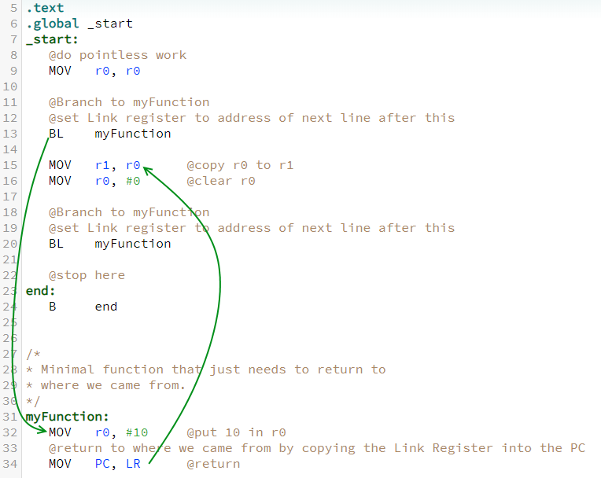

.. include:: ../global.rst

Branch and Link
================================

.. index:: BL, link register, return

In assembly, a function is essentially a set of instructions that we can branch to, run and return from. While the ``B`` instruction is sufficient to jump to a new location before running the next instruction, it does not leave us with any information about how to return to where we were. 

Normally, the ``pc`` register stores the address of the current instruction. So if we want to remember where we were, we could copy the ``pc`` into another register or to the stack before changing it. Then, we could use that stored value to return to where we had been. (If the goal was to return after taking a branch, we would actually want to return to the instruction that is just after the branch to avoid immediately branching again.)

Rather than do this process by hand every time we want to use a branch to run a function, we can use the **branch and link** and **branch exchange** instructions that automates the process. ``BL`` does a branch and sets register r14, also known as the **link register** ``lr`` to the address right after the ``BL``. ``BX lr`` branches to the address stored in the ``lr``.

   Line 13 branches to line 32 and sets the link register to have the address of line 15 (the next instruction).

.. armListing:: BL label

   Branch and Link: Branches to the memory location identified by label and sets the link register, lr, to the address of the instruction after the BL. 

.. armListing:: BX rd

   Branch and eXchange instruction set: Branches to the address stored in register rd. To return after a BL instruction, we can use lr as the register.

   The eXchange refers to the fact that we can use this instruction to switch from 32-bit arm instructions to 16-bit thumb instructions, but we will not be using that feature. 

This code sample demonstrates the operation of the ``BL`` instruction. It twice jumps to the location labeled ``myFunction`` and returns from it. Note that BL sets the ``lr`` register as it executes and ``BX LR`` jumps back to the stored location.

.. armcode::  
   :linenos:
   :emphasize-lines: 13, 20, 31, 34

   /*
      Demonstrates behavior of BL instruction
   */

   .text
   .global _start
   _start:
      @do pointless work
      MOV   r0, r0

      @Branch to myFunction
      @set Link register to address of next line after this
      BL    myFunction

      MOV   r1, r0      @copy r0 to r1
      MOV   r0, #0      @clear r0

      @Branch to myFunction
      @set Link register to address of next line after this
      BL    myFunction

      @stop here
   end:
      B     end

   /*
   * Minimal function that just needs to return to
   * where we came from.
   */
   myFunction:
      MOV   r0, #10     @put 10 in r0
      @return to where we came from
      BX    lr        
