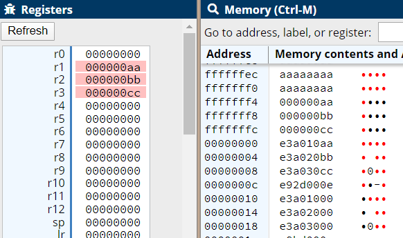

.. include:: ../global.rst

Pushing and Popping
================================

.. index:: PUSH, POP

Because storing registers to the stack is so common, ARM has instructions that move the stack pointer and load or store memory at the same time: ``PUSH`` and ``POP``

.. armListing:: PUSH {ra, rb, rc, ...}

   Stores the listed registers to the top of the stack and adjusts the stack pointer. 
   
   The registers must be listed in order: if you want to push r1, r4, and r7 they must be listed as {r1, r4, r7}.

   Registers are stored in order so that the lowest numbered register is at the lowest address (top of the stack).

The result of pushing r1, r4 and r7 to an empty stack:

.. stackdiagram::

   r7 ,
   r4 ,
   r1 , < sp
      

.. armListing:: POP {ra, rb, rc, ...}

   Loads the listed registers to the stack and adjusts the stack pointer to remove that many words. Registers are popped in order (smallest number first) so if you push a list of registers and then pop the same list, the values end up in the same locations.

   The registers must be listed in order: if you want to pop r1, r4, and r7 they must be listed as {r1, r4, r7}.

The result of popping r8, r9, and r10 on the stack shown above:

.. stackdiagram::
   :empty:

   r7 , Would be stored in r10
   r4 , Would be stored in r9
   r1 , Would be stored in r8

Note that the registers we popped value back into are different than the ones we pushed. This would have the effect of copying r1, r4, and r7 into r8, r9, and r10 respectively.

This sample uses the PUSH and POP instructions to store three registers and then restore their values after they are wiped:

.. armcode::  
 
   .text 
   .global _start
   _start:
   @Some initial values
   MOV   r1, #0xAA
   MOV   r2, #0xBB
   MOV   r3, #0xCC

   @Store to stack using PUSH
   PUSH  {r1, r2, r3}

   @Wipe out registers
   MOV   r1, #0x0
   MOV   r2, #0x0
   MOV   r3, #0x0

   @POP Removes from stack in back to front order. Sample below
   @     removes top of stack into r3, next word into r2, next word into r1
   POP   {r1, r2, r3}

   end:
   B     end

   The final state: the stack pointer is back to 0x00000000 and r1-r3 have been restored from the values that were pushed
   on to the stack.

