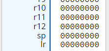
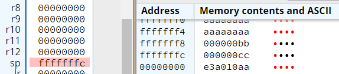

.. include:: ../global.rst

The Stack
================================    

.. index:: stack

The stack is a region of memory typically used by compilers for managing the memory required by functions within a program. It is used by compilers to allocate space for local variables in functions, other book keeping information (like where a function returns to), and to store values from registers when we need to use that register for some new purpose.

The stack gets its name because of the way memory is allocated within it. Memory is never added or removed from the middle of the stack - it is strictly managed by adding or removing to the top. When memory is required, space is allocated at the top of the stack. When that memory is no longer required, it is removed from the stack. 

A register is used to keep track of the memory address for the top of the stack. ``r13`` is usually referred to as the ``sp`` or **stack pointer**. Although programs are free to use this register for any purpose, it is assumed that it will be used to track the top of the stack. When a program starts up, the stack pointer will be initialized to a memory address where the program can start building the stack. In the simulator, when we load any program, the ``sp`` is set to 0x00000000:

This starting location is considered to be already in use (called a **full** stack). We can't add anything new to that address, we first need to move the stack pointer.

In most implementations, the stack grows down in memory - to add something new we place it at a lower memory address than the previous item. This is called a **descending** stack. (We will not be looking at the alternative: **ascending** stack.)

In a descending stack, the bottom of the stack is the highest address and the top of the stack is the lowest address. When we refer to the **top** of the stack, we will be talking about the lowest memory address. 

.. tip::

   Different environments will have different initial addresses for the top of the stack. When you are programming on real Linux hardware, do not assume it will use the same address for the stack.

Working with the stack
------------------------------------

The ``sp`` always points to the top byte of memory on the stack (which is the lowest memory address). To add memory to the stack, we first have to subtract the number of bytes desired from the ``sp`` to find the address to use for the new item. When we are done with memory and are ready to remove it from the stack, we add the same number of bytes to the ``sp`` to "remove". The data is not actually removed from memory, but by moving the stack pointer, we are effectively forgetting that piece of data.

The stack is most commonly used to store register values. Since each register is 4 bytes, we typically add or subtract 4 from the ``sp``. To actually load and store the values from memory, we use ``LDR`` and ``STR`` just like we were accessing any other data in memory. 

This sample demonstrates storing the values from ``r1`` and ``r2`` to the stack, then wiping out the registers, before restoring them from memory. Note that we store ``r1`` before ``r2``, meaning that ``r2`` is on the top of the stack (lowest memory address). 

.. warning::

   The diagrams and images below all show the stack building up... but note that the memory addresses actually get smaller as we go up in the stack. 

.. tabbed:: sample1

   .. tab:: Start

      .. stackdiagram::
         :empty:
          
          ,
          ,
            
      ``sp`` Address of 0x000000 indicates an empty stack (in the simulator).

   .. tab:: Subtract from SP

      .. stackdiagram::

         , < sp
         , 
         
         
      Move the stack pointer into open space... subtracting 4 from 0x00000000 gives 0xFFFFFFFC.

   .. tab:: STR r1

      .. stackdiagram::

         r1 , < sp
         , 

      Store ``r1`` into the space.

   .. tab:: Subtract from SP

      .. stackdiagram::

         r1 ,
         , < sp

      Move the stack pointer into open space...

   .. tab:: STR r2

      .. stackdiagram::

         r1 ,
         r2 , < sp
         
      Store ``r2`` into the space.

When we go to remove value from the stack, we start with the top of the stack (lowest address). In this case, that means we have to remove ``r2`` before ``r1``.

As we restore values from the stack to registers, we add to ``sp`` to "remove" items from the stack. The values that were placed in memory remain there, but we no longer consider them to be part of the stack. We will reuse the space next time we add something to the stack.

This sample shows removing the two value from the stack and then adding ``r3`` back to the stack:

.. tabbed:: sample2

   .. tab:: Start

      .. stackdiagram::

         r1 ,
         r2 , < sp
         
      ``r2`` is the top item on the stack.
         
   .. tab:: LDR r2, add to SP

      .. stackdiagram::

         r1 , < sp
         r2 , 

      ``r1`` is the top item on the stack.  The value that we copied from r2 is still in memory, but no longer part of the stack.
         
   .. tab:: LDR r1, add to SP
         
      .. stackdiagram::
         :empty:

         r1 ,
         r2 ,

      The stack is now empty. The values we copied from r1 and r2 are there but no longer in use.

   .. tab:: Subtract from SP

      .. stackdiagram::

         r1 , < sp
         r2 , 

      Move the stack pointer into the open space that previously held the value stored from r1...

   .. tab:: STR r3

      .. stackdiagram::

         r3 , < sp
         r2 ,
         
      Store ``r3`` into the space.

.. tip::

   Stacks always work in a Last In, First Out (LIFO) fashion. You must remove things in the opposite order you add them.

.. armcode::  
   :linenos:

   .text 
   .global _start
   _start:
   @Some initial values
   MOV   r1, #0xAA
   MOV   r2, #0xBB
   MOV   r3, #0xCC

   @Store r1 to the stack
   SUB   sp, sp, #4     @Move stack pointer down 4 bytes
   STR   r1, [sp]       @Copy r1 to that address

   @Store r2 to the stack
   SUB   sp, sp, #4     @Move stack pointer down 4 bytes
   STR   r2, [sp]       @Copy r2 to that address

   @Wipe out registers
   MOV   r1, #0x0
   MOV   r2, #0x0

   @r2 is at the top of the stack, it must be removed before r1
   LDR   r2, [sp]       @Restore r2 from stack
   ADD   sp, sp, #4     @Move stack pointer up 4 bytes

   @restore r1 from stack and remove it
   LDR   r1, [sp]       @Restore r1 from stack
   ADD   sp, sp, #4     @Move stack pointer up 4 bytes

   @Store r3 to the stack
   SUB   sp, sp, #4     @Move stack pointer down 4 bytes
   STR   r3, [sp]       @Copy r2 to that address

   end:
   B     end

   The final state of memory. Note that the stack pointer does not end up back at 0x00000000 meaning the program left something
   on the stack. Normally you would not want to do that.

