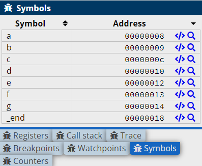

.. include:: ../global.rst

Data & Alignment
================================

.. index:: word, byte, hword, space, align

There are different directives for storing values in different sized chunks of memory:

* **.word** stores a machine word - a 32-bit (4 byte) chunk
* **.hword** stores a half word value in a 16-bit (2 byte) chunk
* **.byte** stores an 8-bit (1 byte) chunk

In addition, we can use **.space** to allocate a specified number of bytes of empty space.

Chunks of memory must be **aligned** in order for instructions to access them. What this means is that
words must always start at an address that is a multiple of 4, and hwords must start at an address that is a multiple of 2. 
We use the **.align** directive to say *"fill out this word of memory"* with 0's so the next data starts at a multiple of 4. 

.. warning::

   Failure to align memory when switching between bytes and words is a common mistake. The program will assemble just fine, but 
   when a load instruction tries to access miss-aligned memory, there will be an error. 
   
   When in doubt, add ``.align`` after 
   each chunk of data. Extra aligns are ignored, so better safe than sorry.

Here are some samples of using the data and align directives:

.. armcode::  

   .data
   @a and b take up 1 byte each
   a:    .byte    4
   b:    .byte    0xBB

   .align @adds 0's to fill until word boundary

   @Word is 4 bytes
   @Should align to 4 bytes before placing word
   c:    .word    0xCCCCCCCC

   @d takes up 2 bytes (half-word)
   d:    .hword   0xDDDD

   @e/f can go in same word as d
   e:    .byte    -1  @0xEE
   f:    .byte    -1  @0xFF

   @g: starts a new word
   g:    .byte    0x12

   .text
   MOV r1, r1   @do nothing

Although you can view the memory in the Disassembly view, it is a little confusing to see "instructions" listed for the data. The Memory tab 
of cpulator allows you to see a plain view of memory: 

.. figure:: Images/alignment.png

In memory, we can see the ``MOV`` instruction (e1a01001) and the 00000000 that the ``.text`` is padded
with. After that, the ``.data`` section begins. First are the bytes **a** and **b** (04 and BB), then the word **c**, etc...

To find a piece of memory, you can use the symbols panel: 

   Click the magnifying glass next to a symbol to highlight it in the memory view. Note that the entire word the symbol is in is highlighted. 

