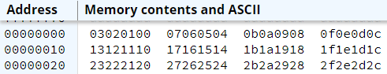
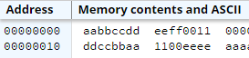
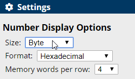
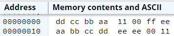

.. include:: ../global.rst

Endianness and Address Numbering
==================================

.. index:: endian

Main memory is addressable at the byte level - we can specify the address of any 8-bit chunk. That means that a machine word, 
32-bits in ARMv7, consists of 4 bytes of memory. The order those bytes are numbered in is called **endianness**. 

In a **big-endian** processor, the bytes are numbered from left to right with the leftmost byte being the lowest address:

.. raw:: html

   <table class="bit-table"><tbody><tr><th>31</th><th>30</th><th>29</th><th>28</th><th>27</th><th>26</th><th>25</th><th>24</th><th>23</th><th>22</th><th>21</th><th>20</th><th>19</th><th>18</th><th>17</th><th>16</th><th>15</th><th>14</th><th>13</th><th>12</th><th>11</th><th>10</th><th>9</th><th>8</th><th>7</th><th>6</th><th>5</th><th>4</th><th>3</th><th>2</th><th>1</th><th>0</th></tr>
   <tr class="bitsrow">
   <td class=" left-border" colspan='8'>byte 0</td>
   <td class=" left-border" colspan='8'>byte 1</td>
   <td class=" left-border" colspan='8'>byte 2</td>
   <td class=" left-border right-border" colspan='8'>byte 3</td>
   </tr>
   </table>

.. figure:: Images/big-endian.svg

In a **little-endian** processor (like ARM or Intel), the bytes are numbered from right to left.

.. raw:: html

   <table class="bit-table"><tbody><tr><th>31</th><th>30</th><th>29</th><th>28</th><th>27</th><th>26</th><th>25</th><th>24</th><th>23</th><th>22</th><th>21</th><th>20</th><th>19</th><th>18</th><th>17</th><th>16</th><th>15</th><th>14</th><th>13</th><th>12</th><th>11</th><th>10</th><th>9</th><th>8</th><th>7</th><th>6</th><th>5</th><th>4</th><th>3</th><th>2</th><th>1</th><th>0</th></tr>
   <tr class="bitsrow">
   <td class=" left-border" colspan='8'>byte 3</td>
   <td class=" left-border" colspan='8'>byte 2</td>
   <td class=" left-border" colspan='8'>byte 1</td>
   <td class=" left-border right-border" colspan='8'>byte 0</td>
   </tr>
   </table>

.. figure:: Images/little-endian.svg

Notice that the view in memory looks reversed - **0D** is the first value that appears in memory, followed by **0C**, then **0B** and finally **0A**.

If you go back to the Data & Alignment page, and look closely at how the data was stored into memory, you will notice that some of it 
looks out of order. This is due to endianness.

.. note:: 

   ARM (and intel) processors are Little Endian - which means that sometimes the 4 bytes of a word in memory will look like they are backwards. 
   Little endian english thgim kool ekil siht (might look like this) - the words are in order, but the letters are backwards. 

This interesting numbering system can be seen in the memory view. Here are the first 48 bytes of memory loaded with values corresponding to their 
address (address 0 has 0x00, address 1 has 0x01...):

Notice that each row of the memory display contains four words, or 16 bytes, of memory. Addresses are always shown in - the address 10 is not ten, but is 0x10 or 16. 
Row 1 has addresses 0x0-0xF (0-15), row 2 has 0x10-0x1F (16-31)... Words are in the expected order: addresses 0-3 come before 4-7, but the bytes within 
each word read backwards: 3, then 2, then 1, then 0.

-------------------------------------------------------------------------

When working with a full word of data, you do not have to worry about endianness - the 32-bit chunk will take up 4 bytes and you don't really 
care how they are ordered. You will need to worry about endianness when:

#. You take/send data from a machine that is one endianess to a machine that is the opposite form. 

#. You work with individual bytes or half words.

This code sample shows the difference between loading a pattern as a word and loading it as a series of bytes and half words.

.. armcode::  

   @allocate 2 words with given hex values
   word1:      .word    0xAABBCCDD
   word2:      .word    0xEEFF0011

   .space 8    @padding between items

   @allocate 4 bytes with given values
   bytes1:     .byte    0xAA, 0xBB, 0xCC, 0xDD
   chunk:      .hword   0xEEEE 
   bytes2:     .byte    0x00, 0x11

It results in this memory:

The first row in the picture shows hex addresses 0x0-0x7 (0x8-0xF are cut out of the picture). The two words were loaded into them: 

.. raw:: html

   <table class="bit-table"><tbody>
   <tr class="bitsrow">
   <td class=" left-border" colspan='12'><em>address</em></td>
   <td class=" left-border" colspan='8'>0x03</td>
   <td class=" left-border" colspan='8'>0x02</td>
   <td class=" left-border" colspan='8'>0x01</td>
   <td class=" left-border" colspan='8'>0x00</td>
   <td class=" left-border" colspan='8'>0x07</td>
   <td class=" left-border" colspan='8'>0x06</td>
   <td class=" left-border" colspan='8'>0x05</td>
   <td class=" left-border right-border" colspan='8'>0x04</td>
   </tr>
   <tr class="bitsrow">
   <td class=" left-border" colspan='12'><em>data</em></td>
   <td class=" left-border right-border" colspan='32'>AABBCCDD</td>
   <td class=" left-border right-border" colspan='32'>EEFF0011</td>
   </tr>
   </table>

   
The second row shows hex addresses 0x10-0x17. The first byte loaded - 0xAA is in address 0x10, but that is not the leftmost address! 
Address 0x11 has the next byte, etc... as shown below:

.. raw:: html

   <table class="bit-table"><tbody>
   <tr class="bitsrow">
   <td class=" left-border" colspan='12'><em>address</em></td>
   <td class=" left-border" colspan='8'>0x13</td>
   <td class=" left-border" colspan='8'>0x12</td>
   <td class=" left-border" colspan='8'>0x11</td>
   <td class=" left-border" colspan='8'>0x10</td>
   <td class=" left-border" colspan='8'>0x17</td>
   <td class=" left-border" colspan='8'>0x16</td>
   <td class=" left-border" colspan='8'>0x15</td>
   <td class=" left-border right-border" colspan='8'>0x14</td>
   </tr>
   <tr class="bitsrow">
   <td class=" left-border" colspan='12'><em>data</em></td>
   <td class=" left-border" colspan='8'>DD</td>
   <td class=" left-border" colspan='8'>CC</td>
   <td class=" left-border" colspan='8'>BB</td>
   <td class=" left-border" colspan='8'>AA</td>
   <td class=" left-border" colspan='8'>11</td>
   <td class=" left-border" colspan='8'>00</td>
   <td class=" left-border right-border" colspan='16'>EEEE</td>
   </tr>
   </table>

However, if you ask the simulator to display numbers in bytes:

It displays bytes in numerical order: 0x00, 0x01, 0x02, ... Notice how in byte mode 
the memory allocated as words (starting at address 0x00) looks jumbled up, while the memory allocated as bytes (starting at 0x10) looks correct.

   The same data displayed in byte mode.