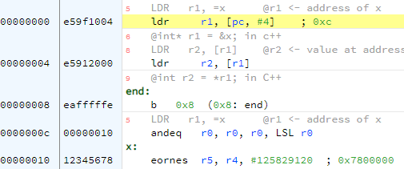

.. include:: ../global.rst

Loading & Storing
================================

.. index:: LDR

ARM is a **load/store** architecture, meaning that most of the instructions can only work on registers. To work with data
we must first load it into a register. When we are done working on it, we store it back to memory.

To load data we use the load register instruction. It typically is a two step process. First we load the address of the data
that we want, then we load the data itself. We need this two step process because the memory address we want to load from is 
a 32-bit value - it cannot be included inside the instruction as it is too big. The address must be loaded into a register that 
can hold the full 32 bit value.

.. armlisting::  LDR rd, =LABEL

   Load rd with the address that corresponds to the thing labeled with LABEL. 
   This gets the address of the data, not the data itself.
   Similar to the & operator in C/C++

.. armlisting::  LDR rd, [rn]

   Load rd with the word of memory at the location stored in rn. This loads the actual data
   pointed at by the register.
   This is similar to the * operator in C/C++

.. armcode::  

   .data
   x:   .word   0x12345678

   .text
   LDR   r1, =x      @r1 <- address of x
                     @int* r1 = &x; in c++

   LDR   r2, [r1]    @r2 <- value at address stored in r1
                     @int r2 = *r1; in C++
   
   end:  b end       @stop program

If you look closely at the assembled version of that code, you will notice that in the assembled version, the ``=x`` has been replaced 
by ``[pc, #4]``. 

**[pc, #4]** means 4 bytes past where the Program Counter currently is. When the first LDR runs, the program counter will be 00000000 
(the address of that instruction). In early version of the ARM architecture, the PC would actually be 8 bytes past that when the instruction 
executed. So the final address would be 0x00000000 + 4 + 8 = 12 = 0xC. If you look at address 0000000C, it contains the data 0x00000010. 
0x00000010 is in fact the address of **x**. The assembler has: 1) calculated the address of **x**; 2) stored that value in memory at the end of 
the .text; 3) set the first LDR to load that value. That is all fairly complex, but most of the time, we do not have to worry about the 
mechanics. We just use ``LDR rd, =LABEL`` and count on the assembler to manage the details.

Loading an Immediate
--------------------------------

We can use the assembler's tricks to have it load a value that is too large/complex to fit as the immediate value in a MOV instruction.
A load can specify a numeric value to load, the assembler will place it into memory and automatically calculate the address for it.

.. armlisting::  LDR rd, =value

   Load rd with the value specified. The value is not an immediate - it does not get # in front of it. 

.. armcode::  

   LDR   r1, =0xABCDABCD
   LDR   r2, =45000
   
   end:  b end       @stop program

.. note:: 

   A load instruction may be less efficient than MOV instructions that do not rely on a trip to memory. ARMv7 provides ``MOVT`` and ``MOVW`` 
   instruction that each can move a 16-bit chunk of data into a register. ``MOVW`` loads the lower 16-bits of a register and wipes out the top 16-bits. 
   ``MOVT`` places 16-bits in the top 16-bits of the register, leaving the lower 16 bits unmodified. So a ``MOVW`` followed by a ``MOVT`` is 
   likely a more efficient way to load a 32-bit value than loading it.

Storing
--------------------------------

.. index:: STR

To store a piece of data back to memory after working on it in registers, we use the store register instruction:

.. armlisting::  STR rs, [rn]

   Take the value that is stored in rs and store it into memory at the location in rn.
   Note that the destination is the second register!!!

The store register instruction needs to have the address it will store to loaded into a register, so it will usually be preceded by a 
``LDR rn, =identifier`` instruction that loads the memory address we are going to store to. This program loads data from a variable 
**x**, multiplies it by 2 and stores the answer back to **y**:

.. armcode::  

   .data
   x:   .word   5
   y:   .word   0

   .text
   _start:
   LDR   r1, =x      @r1 <- address of x  (&x)
   LDR   r2, [r1]    @r2 <- x

   LSL   r2, r2, #1  @r2 <- r2 * 2

   LDR   r3, =y      @r3 <- address of y  (&y)
   STR   r2, [r3]    @store from r2 to location given by r3
                     @y <- r2
   
   end:  b end       @stop program
