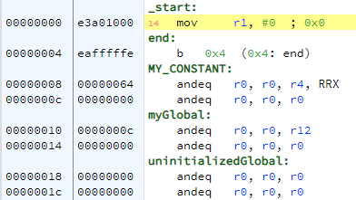

.. include:: ../global.rst

Sections
================================

.. index:: section

Assembled code is broken into logical sections that serve various purposes. The bits that represent instructions must be 
executable but should generally not be writable. The bits that represent data should be readable and writable but may not make
sense to execute. 

Some common sections:

* **text** stores the code of the program
* **data** stores global data that can be read or written
* **rodata** stores global information that is Read Only (constants)
* **bss** has uninitialized blank space that we have reserved for use by the program to store data

Directives are used to specify what section various parts of an assembly program belong to:

.. armcode::  

    .section       .text
    @Do nothing...
    MOV   r1, #0xFF
    MOV   r2, #0xFF

    .section       .data
    X:              .word   0xAAAAAAAA

    .section       .rodata
    MY_CONSTANT:   .word    0xBBBBBBBB

    .section       .bss
    @create 4 bytes of space
    blank:          .space  4

    .section       .text
    @Do nothing...
    MOV   r3, #0xFF
    MOV   r4, #0xFF

That code gets build into what is shown below. Some things to note:

* All the information in a particular section gets recombined - all four of the ``MOV`` instructions end up in one block in the assembled program.
* The sections appear in a specific order: ``text``, ``rodata``, ``data``, then ``bss``.
* Sections may be **padded** with extra 0's to make them occupy a number of bytes that is some specific power of 2. In other words, each section must end at a byte number that is divisible by 4 or 8 and extra 0's are used to make that happen. We can see that below at the end of the .data, .bss. and .rodata sections.

.. warning:: 

    It is critical that code be placed in ``text`` and data in ``data``. Most of the time, this tutorial will stick to using just
    those two sections.